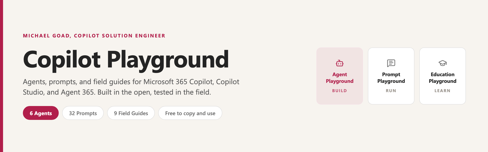

<picture>
  <source media="(prefers-color-scheme: dark)" srcset="assets/hero-dark.png">
  <source media="(prefers-color-scheme: light)" srcset="assets/hero-light.png">
  
</picture>

# Agents, prompts, and field guides for Microsoft 365 Copilot

I am a Copilot Solution Engineer at Microsoft, and since joining I have been sharing what I learn, build, and break in the open.

This is the whole library: **6 agents**, **33 prompts**, and **10 field guides** covering how to design, deploy, govern, and teach AI across Microsoft 365 Copilot, Copilot Studio, and Agent 365. Everything here is free to copy, adapt, and use.

> [!NOTE]
> This is a personal community resource. The analysis and opinions are my own and are not an official Microsoft position.

## Start here

New to this? Pick the row that sounds like you.

| If you are | Start with |
| --- | --- |
| Brand new to Copilot | [Getting Started with Copilot](./prompt%20playground/getting%20started%20with%20copilot.md), then [10 Starter Chat Prompts](./prompt%20playground/10%20starter%20copilot%20chat%20prompts.md) |
| An executive or leader | [The Executive Playbook](./education%20playground/getting%20started%20with%20copilot%20premium%2C%20an%20executive%20playbook.md) |
| Running IT, security, or compliance | [Copilot Governance](./education%20playground/copilot%20governance%20getting%20started.md), then [The Copilot Reporting Map](./education%20playground/the%20copilot%20reporting%20map.md) |
| Deciding who gets licensed | [Licensing and Deployment](./education%20playground/copilot%20licensing%20and%20deployment%2C%20who%20gets%20what.md) |
| Ready to build an agent | [Chief of Staff](./agent%20playground/chief%20of%20staff.md) |

## What is in here

| Playground | Count | What it is |
| --- | --- | --- |
| [Agent Playground](#agent-playground) | 6 | Agents I have built, with setup steps and starter prompts |
| [Prompt Playground](#prompt-playground) | 33 | Prompts and personalizations, ready to copy |
| [Education Playground](#education-playground) | 10 | Field guides for admins, executives, and practitioners |

---

## Agent Playground

Agents built while learning Copilot Studio and Microsoft 365 Copilot. Each page includes an overview and licensing notes, setup with connectors and permissions, and starter prompts.

### Productivity and work management

| Agent | What it does |
| --- | --- |
| [BossBuddy](./agent%20playground/bossbuddy.md) | A virtual manager for strategy, career growth, and opportunity coaching |
| [Taskmaster](./agent%20playground/taskmaster.md) | Chief of staff that tracks work, surfaces priorities, and pulls action items |
| [Chief of Staff](./agent%20playground/chief%20of%20staff.md) | Build your own in about 15 minutes. Includes two Word templates |

### Impact and self-awareness

| Agent | What it does |
| --- | --- |
| [Impact Check](./agent%20playground/impact%20check.md) | Shows your real influence across projects and teammates, from data you already have |

### Communication and presentation

| Agent | What it does |
| --- | --- |
| [Professor X](./agent%20playground/professor%20x.md) | Presentation coach. Submit a transcript, get actionable feedback |

### Contracts and compliance

| Agent | What it does |
| --- | --- |
| [Redline Rover](./agent%20playground/readline%20rover.md) | Bidirectional gap analysis between quality templates and customer agreements. Built by [Sue Vencill](https://www.linkedin.com/in/suevencill/) |

---

## Prompt Playground

Favorite prompts and personalizations. Most pages have a Quick Copy block so you can grab the prompt in one click.

### Getting started

| Prompt | What it does |
| --- | --- |
| [Getting Started with Copilot](./prompt%20playground/getting%20started%20with%20copilot.md) | Learn the ropes and get comfortable with your first prompts |
| [10 Starter Chat Prompts](./prompt%20playground/10%20starter%20copilot%20chat%20prompts.md) | Ten practical prompts for summaries, rewrites, agendas, and FAQs |

### Personalization and memory

| Prompt | What it does |
| --- | --- |
| [Copilot Memory](./prompt%20playground/copilot%20memory.md) | Examples for adding information to Copilot's memory |
| [Copilot Personalization](./prompt%20playground/copilot%20personalization.md) | Templates for customizing how Copilot responds to you |

### Daily workflow

| Prompt | What it does |
| --- | --- |
| [Start My Day](./prompt%20playground/start%20my%20day.md) | A morning overview to run daily |
| [Kick-off, Reset, and Wrap-up](./prompt%20playground/morning-kickoff-afternoon-reset-and-wrap-up.md) | Three-part set covering your full workday |
| [Check My Calendar](./prompt%20playground/check%20my%20calendar.md) | A quick read on what is ahead |
| [Meeting Notes to Action Table](./prompt%20playground/meeting%20notes%20to%20action%20items.md) | Raw notes into a prioritized action table and executive summary |
| [Copilot in Outlook Prompt Pack](./prompt%20playground/copilot%20in%20outlook%20prompt%20pack.md) | Inbox triage, thread summaries, drafting, tone control, meeting prep |
| [Executive Assistant Prompt Pack](./prompt%20playground/executive%20assistant%20prompt%20pack.md) | Inbox triage, time zone scheduling, minutes, contracts, and event logistics for admin professionals |
| [Copilot for Executive Admins](./prompt%20playground/copilot%20for%20executive%20admins.md) | The four-ingredient prompt method and 25 prompts for agendas, drafts, trip briefs, catch-ups, and delegate mailboxes |

### Writing and output quality

| Prompt | What it does |
| --- | --- |
| [Proofread](./prompt%20playground/proofread%20prompt.md) | Run your writing through a Copilot proofreading pass |
| [Next Level](./prompt%20playground/level%20up%20prompt.md) | Take any output further and sharpen the final product |
| [Copywriting Precision and Tone](./prompt%20playground/copywriting%20precision%20and%20tone%20enhancer.md) | Senior-level copy editing that preserves your voice |
| [Copilot in PowerPoint Skills Pack](./prompt%20playground/copilot%20in%20powerpoint%20skills%20pack.md) | Twelve custom skills, each with a copy-paste SKILL.md |

### Growth and mindset

| Prompt | What it does |
| --- | --- |
| [Worst Traits](./prompt%20playground/worst%20traits.md) | Surface blind spots and build on them |
| [Positivity Prompts](./prompt%20playground/positivity%20prompts.md) | Reframe your thinking and stay grounded |
| [Career Growth](./prompt%20playground/career%20growth.md) | A 90-day plan for your role, relationships, and team impact |
| [Weekly Case Study Review](./prompt%20playground/weekly%20case%20study%20review.md) | Reframe your week as a structured business case study |
| [Capability and Growth Planner](./prompt%20playground/career%20capability%20and%20growth%20planner.md) | Evidence-based strengths, gaps, and recommended next steps |
| [My Work Life on One Whiteboard](./prompt%20playground/my%20work%20life%20on%20one%20whiteboard.md) | Your role, people, and values as one whiteboard sketch |
| [Teach-Back Tutor](./prompt%20playground/teach-back%20tutor.md) | Turns a doc, deck, or meeting into a five-question quiz that waits for your answers |

### Executive and leadership

| Prompt | What it does |
| --- | --- |
| [10 Prompts for Executives](./prompt%20playground/10%20executive%20prompts.md) | A curated set built for leadership workflows |
| [Contextual Filter](./prompt%20playground/contextual%20filter%2C%20gain%20a%20new%20perspective%20prompt.md) | Read any document through a specific role's lens |
| [Devil's Advocate](./prompt%20playground/devils%20advocate%20skeptical%20stakeholder.md) | Surface the three likeliest failure points before the room does |
| [Leadership Style and Voice Distiller](./prompt%20playground/leadership%20style%20and%20voice%20distiller.md) | Mine a year of your comms into a personal voice reference |
| [Stakeholder Dress Rehearsal](./prompt%20playground/stakeholder%20dress%20rehearsal.md) | Test a message against three audiences, then rewrite it under 300 words |

### Copilot Cowork

Deeper analysis and scheduled output across your Microsoft 365 activity.

| Prompt | What it does |
| --- | --- |
| [Manager 1:1 Weekly Update](./prompt%20playground/1%20on%201%20weekly%20manager%20update%20for%20copilot%20cowork.md) | A leadership-ready field impact readout from your week |
| [Monthly Account Review](./prompt%20playground/monthly%20account%20review.md) | Portfolio review with executive summary, PowerPoint, and HTML |
| [Daily Executive Field Readout](./prompt%20playground/daily%20account%20and%20executive%20readout.md) | Weekday briefing on commitments, risks, and field priorities |
| [The Copilot Chronicle](./prompt%20playground/daily%20ai%20news.md) | A newspaper-styled daily AI news brief in your inbox |

### Skills

| Skill pack | What it does |
| --- | --- |
| [Guardian Council](./prompt%20playground/guardian%20council%20skills.md) | Five installable skills: four decision lenses plus a synthesizer |

### IT and technical

| Prompt | What it does |
| --- | --- |
| [IT Power Moves Prompt Pack](./prompt%20playground/it%20power%20moves%20prompt%20pack.md) | Error decoding, script drafting, regex, stack traces, config diffs |

### Coding

| Prompt | What it does |
| --- | --- |
| [Grill My Coding Plan](./prompt%20playground/grill%20my%20coding%20plan.md) | A relentless reviewer that stress-tests a plan one decision at a time |
| [Karpathy Coding Guidelines](./prompt%20playground/karpathy%20coding%20guidelines.md) | Habits that cut scope creep, needless abstractions, and happy-path fixes |

---

## Education Playground

Field guides for IT admins, executives, and anyone who has to manage, govern, or explain AI at scale. Every claim is checked against Microsoft documentation.

### For executives and leaders

| Guide | What it covers | Extras |
| --- | --- | --- |
| [The Executive Playbook](./education%20playground/getting%20started%20with%20copilot%20premium%2C%20an%20executive%20playbook.md) | Nine sessions, from a first 5-minute win to a 30-day habit plan | [Interactive](https://heyitsgoad.github.io/copilot-playground/education%20playground/assets/executive%20copilot%20playbook/), PDF, 2 decks |

### Governance and administration

| Guide | What it covers | Extras |
| --- | --- | --- |
| [Copilot Governance](./education%20playground/copilot%20governance%20getting%20started.md) | Admin Center, Studio, Power Platform, Purview, and SAM controls | 4 sessions |
| [The Copilot Reporting Map](./education%20playground/the%20copilot%20reporting%20map.md) | Every report that measures Copilot, across admin center, Copilot Analytics, agents, SharePoint, and Purview | [Interactive](https://heyitsgoad.github.io/copilot-playground/education%20playground/assets/the%20copilot%20reporting%20map/), 36 reports |
| [Microsoft Agent 365](./education%20playground/microsoft%20agent%20365%20licensing%20architecture%20and%20how%20it%20fits%20into%20your%20ai%20strategy.md) | Licensing, the three-plane model, identity, and observability | Names the doc gaps |
| [Copilot Chat, HIPAA, and Web Search](https://github.com/heyitsgoad/copilot-chat-hipaa-websearch) | What actually crosses the tenant boundary under your BAA | PDF |
| [Right-Sizing Cowork](./education%20playground/right-sizing%20cowork%20who%20actually%20needs%20it.md) | Scope the spend by persona instead of by headcount | PDF, PPTX |
| [Licensing and Deployment](./education%20playground/copilot%20licensing%20and%20deployment%2C%20who%20gets%20what.md) | Which Copilot each role needs, and a rollout that scales | [Interactive](https://heyitsgoad.github.io/copilot-playground/education%20playground/assets/copilot%20licensing%20and%20deployment/), deck, cheat sheet |
| [Copilot Agent Billing](./education%20playground/copilot%20agent%20billing%2C%20credits%20and%20cost%20attribution.md) | Credits, cost attribution, spend controls, and who actually pays | [Interactive](https://heyitsgoad.github.io/copilot-playground/education%20playground/assets/copilot%20agent%20billing/), 46-page PDF |

### Hands-on use and demos

| Guide | What it covers | Extras |
| --- | --- | --- |
| [Claude in Copilot, Agent Mode for Excel](./education%20playground/claude%20in%20copilot%20with%20agent%20mode%20for%20excel.md) | Claude-level Excel reasoning inside Microsoft 365 Copilot | Demo data, video |

### Best practices and strategy

| Guide | What it covers | Extras |
| --- | --- | --- |
| [Why AI Cannot Find Your Files](./education%20playground/ai-ready%20file%20naming%20and%20metadata%20for%20ai.md) | Naming and metadata that help AI return better answers | PDF, video |

---

## Tech covered

Microsoft 365 Copilot, Copilot Studio, Agent 365, Copilot Cowork, Purview, Intune, Power Platform, Azure OpenAI, and local or open models.

## Using this content

Everything here is [MIT licensed](./LICENSE). Copy it, fork it, adapt it, ship it. Attribution is appreciated but not required.

Found something wrong or out of date? Open an issue.
